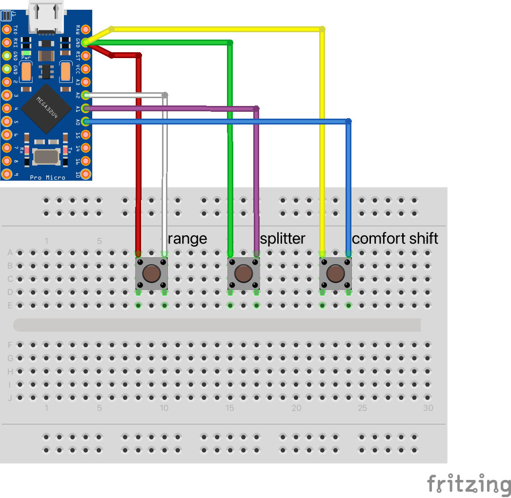

# DIY real truck shifter

Because I'm playng Eurotruck Simulator 2 with my T300 + TH8A I wanted to have a shifter that has buttons for range and splitter.

Because I didn't want to spent over 100EUR for a simple gear stick with two or three buttons I decided to bought a cheap MAN shifter (81326200043) from china (in fact something about 16EUR on Amazon).

After that I've used my multimeter to find out the connections between the pins on the socket.

Later I had to open the shifter and could see the connections.

The TH8A uses an M9x1.25 thread and the shifter provides an M14x1.5 thread - unfortuately I didn't find an adapter to buy.

Luckily a forum-member offerd my to print this adapter from thingiverse.

https://www.thingiverse.com/thing:4827444

# Pinout

This is my numbering according to the colors on the plug.
```
0 (black)   1 (blue)    2 (two wires, green/yellow)
3 (purple)  4 (red)     5 (white)
```
ATTENTION: There is a resistor between red and white (range switch) which has to be removed.
To open the shifter you can carefully remove the plastic-piece (with the printed gears) with a plastic tool (just pull the plastic-piece backwards).

These are the connections between the pins
- comfort shift (top): 0 + 2 (normally closed), 1 + 2 (normally open), 1 + 3 (normally open, only if splitter is closed), 0 + 3 (normally closed, if splitter is closed)
- splitter (side): 2 (green)+ 3 (purple)
- range (front): 4 (red)+ 5 (white)

so i think the wiring could be done like this.
```
2 (green+yellow) + 4 (red) -> GND
1 (blue) -> PIN18 (comfort shift)
3 (purlple) -> PIN19 (splitter)
5 (white) -> PIN20 (range)
```


I'm using an arduino pro micro because it fits inside the shifter. :-)

You have to install this library in Arduino IDE: https://github.com/MHeironimus/ArduinoJoystickLibrary

# Pictures


Because I have multiple USB devices I had to change the name of the usb device.

Therefore I've edited boards.txt from Arduino IDE and copied the complete block for leonardo.name=Arduino Leonardo

Then I've changed the IDs from "leonardo." to "leonardo_truckshifter." and the name and usb_product from "Arduino Leonardo" to "Arduino Leonardo (TruckShifter)".

As last step I've changed to VID to 0x2341 and the PID to 0xA001.

In the end it looks something like this.
-> This is only an example and for private use only because you have to pay for official/commercial VIDs and PIDs!!!!
```
leonardo_truckshifter.name=Arduino Leonardo (TruckShifter)
leonardo_truckshifter.vid.0=0x2341
leonardo_truckshifter.pid.0=0x0036
leonardo_truckshifter.vid.1=0x2341
leonardo_truckshifter.pid.1=0x8036
leonardo_truckshifter.vid.2=0x2A03
leonardo_truckshifter.pid.2=0x0036
leonardo_truckshifter.vid.3=0x2A03
leonardo_truckshifter.pid.3=0x8036
leonardo_truckshifter.vid.4=0x2341
leonardo_truckshifter.pid.4=0xA001

leonardo_truckshifter.upload.tool=avrdude
leonardo_truckshifter.upload.protocol=avr109
leonardo_truckshifter.upload.maximum_size=28672
leonardo_truckshifter.upload.maximum_data_size=2560
leonardo_truckshifter.upload.speed=57600
leonardo_truckshifter.upload.disable_flushing=true
leonardo_truckshifter.upload.use_1200bps_touch=true
leonardo_truckshifter.upload.wait_for_upload_port=true

leonardo_truckshifter.bootloader.tool=avrdude
leonardo_truckshifter.bootloader.low_fuses=0xff
leonardo_truckshifter.bootloader.high_fuses=0xd8
leonardo_truckshifter.bootloader.extended_fuses=0xcb
leonardo_truckshifter.bootloader.file=caterina/Caterina-Leonardo.hex
leonardo_truckshifter.bootloader.unlock_bits=0x3F
leonardo_truckshifter.bootloader.lock_bits=0x2F

leonardo_truckshifter.build.mcu=atmega32u4
leonardo_truckshifter.build.f_cpu=16000000L
#leonardo_truckshifter.build.vid=0x2341
#leonardo_truckshifter.build.pid=0x8036
leonardo_truckshifter.build.vid=0x2341
leonardo_truckshifter.build.pid=0xA001
leonardo_truckshifter.build.usb_product="Arduino Leonardo (TruckShifter, 0x2341/0xA001)"
leonardo_truckshifter.build.board=AVR_LEONARDO
leonardo_truckshifter.build.core=arduino
leonardo_truckshifter.build.variant=leonardo
leonardo_truckshifter.build.extra_flags={build.usb_flags}
```

HINT: Arduino IDE uses different boards.txt - one is located in your installation-folder under hardware\arduino\avr and the other under %LOCALAPPDATA%\Arduino15\packages\arduino\hardware\avr\1.8.4 (at least on windows - versions may change).

So if there is no "Arduino Leonardo (TruckShifter)" in your boards-list, make sure, that you have edited the correct boards.txt
