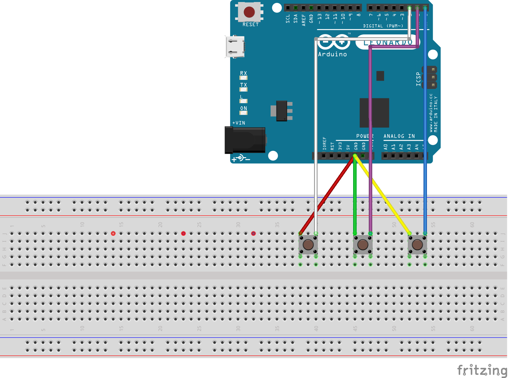

# DIY real truck shifter

Because I'm playng Eurotruck Simulator 2 with my T300 + TH8A I wanted to have a shifter that has buttons for range and splitter.

Because I didn't want to spent over 100EUR for a simple gear stick with two or three buttons I decided to bought a cheap MAN shifter (81326200043) from china (in fact something about 16EUR on Amazon).

After that I've used my multimeter to find out the connections between the pins on the socket.

Later I had to open the shifter and could see the connections.

The TH8A uses an M9x1.25 thread and the shifter provides an M14x1.5 thread - unfortuately I didn't find an adapter to buy.

Luckily a forum-member offerd my to print this adapter from thingiverse.

https://www.thingiverse.com/thing:4827444

# Pinout

This is my numbering according to the colors on the plug.
```
0 (black)   1 (blue)    2 (two wires, green/yellow)
3 (purple)  4 (red)     5 (white)
```
ATTENTION: There is a resistor between red and white (range switch) which has to be removed.
To open the shifter you can carefully remove the plastic-piece (with the printed gears) with a plastic tool (just pull the plastic-piece backwards).

These are the connections between the pins
- comfort shift (top): 0 + 2 (normally closed), 1 + 2 (normally open), 1 + 3 (normally open, only if splitter is closed), 0 + 3 (normally closed, if splitter is closed)
- splitter (side): 2 (green)+ 3 (purple)
- range (front): 4 (red)+ 5 (white)

so i think the wiring could be done like this.
```
2 (green+yellow) + 4 (red) -> GND
1 (blue) -> PIN18 (comfort shift)
3 (purlple) -> PIN19 (splitter)
5 (white) -> PIN20 (range)
```



I'm using an arduino pro micro because it fits inside the shifter. :-)

# Pictures


